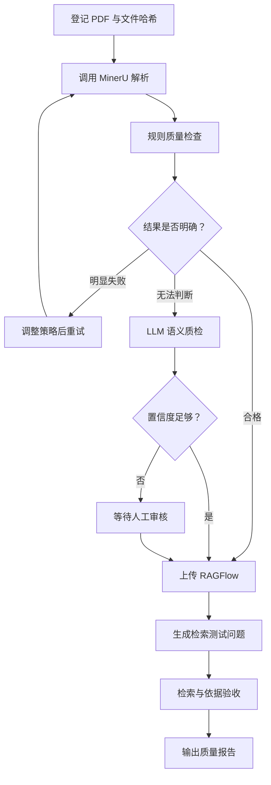

# PaperOps Agent

[](https://github.com/oranchpekoe/multi-mode-agent/actions/workflows/unit-tests.yml)
[](https://www.python.org/downloads/)

面向实验室科研文献的解析、质量验收与知识库入库工作流。

PaperOps 的目标不是再实现一个通用聊天 Agent，而是解决一个可以验证的具体问题：**PDF 被 MinerU 成功解析并上传 RAGFlow，并不代表知识库真正可用**。双栏排版、公式、表格、图片和扫描页可能产生隐蔽的内容缺失，需要一条可重试、可人工审核、可恢复并能进行检索验收的处理链路。

## 当前状态

项目正在从多模式 LangGraph 原型重构为领域工作流：

- `v0.1-multimode-demo`：已归档的四模式 Agent 学习原型；
- 当前分支：完成产品边界、包结构、依赖和上游归属整理；
- PR2：使用 Fake MinerU/RAGFlow Client 跑通单文档状态机；
- PR3：接入真实服务、持久化和人工审批 API；
- PR4：构建公开论文评测集并与“直接解析上传”基线对比。

> 当前 `langgraph.json` 暂时仍暴露归档前的多模式图，便于迁移期间回归验证。PaperOps 可执行图将在 PR2 加入。本 README 不宣称尚未实现的功能。

## 目标用户与输入输出

**用户**：需要批量整理科研论文的实验室学生或研究人员。

**输入**：单篇科研 PDF；后续扩展为批次目录。

**输出**：

- MinerU 解析产物及质量报告；
- RAGFlow 文档 ID 和索引状态；
- 基于文档生成的检索测试集；
- 检索命中与答案依据验收报告；
- 失败原因、重试记录和人工审核记录。

## MVP 工作流



稳定步骤由普通代码执行，LLM 只处理规则无法可靠判断的语义质量问题。解析正文保存在 artifact 目录，LangGraph State 只保存路径、状态和结构化决策，避免大型文档反复进入 checkpoint。

## 仓库结构

```text
src/
├── paperops/                 # 新的领域应用边界
│   ├── models.py             # 任务状态与质量决策模型
│   ├── state.py              # 单文档 LangGraph State
│   ├── settings.py           # PAPEROPS_* 环境配置
│   ├── api/                  # PR3: FastAPI 与人工审批
│   ├── clients/              # PR2/PR3: MinerU、RAGFlow 适配器
│   └── nodes/                # PR2: 领域工作流节点
└── react_agent/              # v0.1 原型，迁移期间保留

knowledge/                    # 本地论文输入，不提交 Git
tests/                        # 单元、集成和后续评测
docs/                         # 产品约束、上游归属和技术复盘
```

仓库目录使用连字符 `multi-mode-agent`，Python 包使用合法标识符 `paperops`。`src/` 布局用于确保测试验证的是正确安装后的包，而不是碰巧从仓库根目录导入源码。

## 开发环境

前置条件：

- Python 3.11 或 3.12；
- [uv](https://docs.astral.sh/uv/)；
- 仅运行 PR1 单元测试时不需要任何 API Key。

安装全部开发与可选依赖：

```bash
uv sync --all-extras
```

运行检查：

```bash
uv run ruff check .
uv run pytest tests/unit_tests -q
```

需要回归旧版图时，复制 `.env.example` 为 `.env` 并填写模型配置，然后运行：

```bash
uv run langgraph dev
```

## 配置边界

PaperOps 配置统一使用 `PAPEROPS_` 前缀：

| 变量 | 默认值 | 作用 |
|---|---|---|
| `PAPEROPS_ARTIFACTS_DIR` | `artifacts` | 解析产物和报告目录 |
| `PAPEROPS_KNOWLEDGE_DIR` | `knowledge` | 本地科研文献输入目录 |
| `PAPEROPS_MAX_PARSE_ATTEMPTS` | `2` | 单文档最大解析次数 |

MinerU 和 RAGFlow 地址将在真实适配器进入 PR3 时启用。密钥只保存在本地 `.env`，不得提交到仓库。

## 上游与个人实现边界

本仓库最初从 [LangGraph ReAct Agent Template](https://github.com/langchain-ai/react-agent) 拉取。上游提供了标准 Python `src/` 布局、模型/状态/工具骨架和一个基础 ReAct 循环。

归档的 v0.1 原型在上游基础上新增或重构了 Plan-Solve、Reflection、Supervisor、模式路由、MCP、RAG、记忆、流式输出和评测代码。详细基线与提交证据见 [docs/upstream.md](docs/upstream.md)。PaperOps 产品化继续保留上游 Git 历史和 MIT 许可证。

## 产品约束

- 第一版只处理单文档，不承诺大规模批处理；
- 不把规则可确定的步骤包装成 Agent；
- 不在宿主进程执行不受信任的 Python；
- 不用自定义综合分数代替任务成功率、检索命中率和人工介入率；
- 不在代码和 README 中宣称尚未通过测试的生产能力。

完整 MVP 范围和验收条件见 [docs/product-spec.md](docs/product-spec.md)。

## License

MIT。原始 LangGraph 模板版权声明保留在 [LICENSE](LICENSE) 中。
