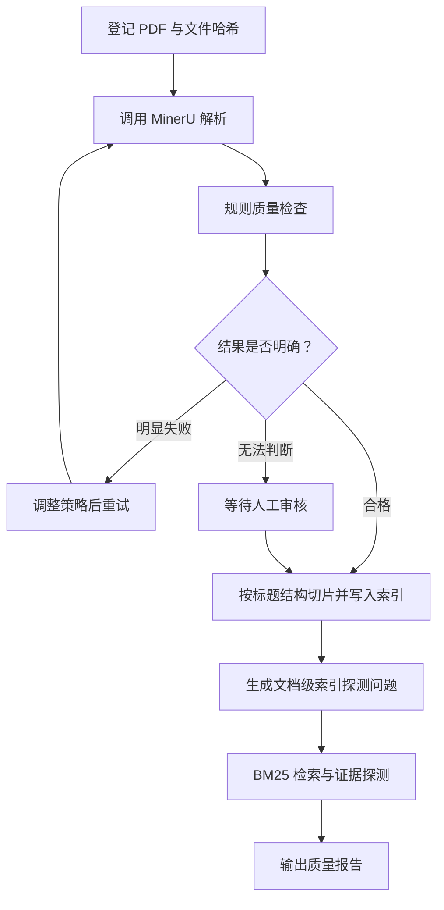
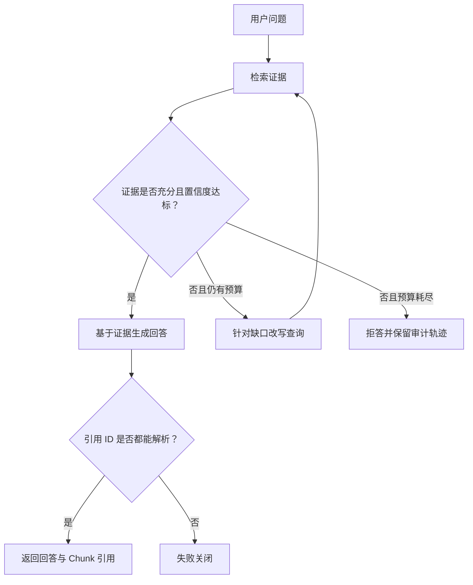

# PaperOps Agent

[](https://github.com/oranchpekoe/paperops-agent/actions/workflows/unit-tests.yml)
[](https://www.python.org/downloads/)

面向实验室科研文献的解析、质量验收、结构化切片与检索工作流。

PaperOps 的目标不是再实现一个通用聊天 Agent，而是解决一个可以验证的具体问题：**PDF 被解析并写入索引，不代表证据能够被可靠召回**。双栏排版、公式、表格、图片和扫描页可能产生隐蔽的内容缺失；不透明的切片和检索策略又会掩盖召回失败，因此需要一条可重试、可人工审核、可恢复且检索过程可评测的处理链路。

## 当前状态

项目已经从通用多模式原型切换为单一领域工作流：

- `v0.1-multimode-demo`：已归档的四模式 Agent 学习原型；
- PR1：完成产品边界、包结构、依赖和上游归属整理；
- PR2：使用 Fake Parser/Retrieval Backend 跑通单文档状态机、重试、人工中断、checkpoint 恢复和幂等入库；
- PR3：已接入 MinerU、SQLite checkpoint、作业 API，以及自研结构感知切片和 FTS5/BM25 检索基线；
- PR4：增加稠密召回、RRF 融合、交叉编码器重排与独立 QASPER 评测；默认仍保留经过对照的 BM25 基线；
- PR5：增加独立的论文调研 Query Graph，按证据充分度执行最多两轮查询改写与补检，校验 Chunk 引用，并在证据不足时拒答；
- PR6：在同一语料、检索后端、模型和问题上，对比零次改写基线与有界补检 Agent，分别报告证据覆盖、拒答、引用、延迟、调用次数和供应商 token；
- PR7：让两组共享初始检索与判断，按所属论文约束 QASPER 检索；补检无新增证据时提前停止，并只把充分度判断选出的最小相关证据集交给回答模型；
- 当前 PR8：面向已入库论文生成“论文 × 明确维度”证据矩阵，只对缺失单元格执行一次文档内补检，并用共享初始矩阵的配对评测报告恢复收益与额外成本。

> `langgraph.json` 继续暴露确定性 Fake 图用于 Studio 调试。真实服务由 FastAPI 应用按 `PAPEROPS_CLIENT_MODE=real` 装配，防止导入模块或运行单测时误调用外部服务。

## 目标用户与输入输出

**用户**：需要批量整理科研论文的实验室学生或研究人员。

**输入**：单篇科研 PDF、面向已索引 Collection 的研究问题，或 2–8 篇已入库论文与 1–6 个明确比较维度。

**输出**：

- MinerU 解析产物及质量报告；
- 原生索引文档 ID、Chunk 数量和标题路径；
- 一条文档级探测问题及其检索证据；
- 检索命中验收报告；
- 带稳定 Chunk 引用的调研回答，或结构化的证据不足结果；
- 保留初始结果、缺口、补检轨迹和 Chunk 引用的多论文证据矩阵；
- 失败原因、重试记录和人工审核记录。

## MVP 工作流



稳定步骤由普通代码执行。解析正文保存在 artifact 目录，LangGraph State 只保存路径、状态和结构化决策，避免大型文档反复进入 checkpoint。当前规则无法可靠判断时直接通过 LangGraph `interrupt()` 进入人工审核；是否增加 LLM 语义质检留给后续评测决定，而不是预设它一定有效。

PR5 的调研查询使用第二张图，与入库状态机分离：



模型只负责证据判断、查询改写和回答生成三个有类型约束的语义动作。循环上限、低置信度门槛、证据去重、上下文字符预算、重复查询拦截和引用校验均由普通代码控制。

## 仓库结构

```text
src/paperops/
├── graph.py                  # 可执行 LangGraph 与条件路由
├── models.py                 # 边界请求、决策、报告和错误模型
├── state.py                  # 只保存引用和小型决策的 Graph State
├── settings.py               # PAPEROPS_* 环境配置
├── clients/
│   ├── protocols.py          # Parser/Retrieval Backend 能力协议
│   ├── fakes.py              # 幂等 Fake Client 与故障注入
│   ├── mineru.py             # 官方异步任务 API、恢复 manifest 与安全解压
│   └── ragflow.py            # 文档上传、索引轮询与检索适配器
├── retrieval/
│   ├── chunking.py           # 标题感知切片与确定性探测问题
│   ├── native.py             # SQLite FTS5/BM25 默认检索后端
│   ├── dense.py              # sqlite-vec 稠密检索后端
│   ├── hybrid.py             # RRF 融合与有界重排
│   └── providers.py          # 可替换的向量与重排模型协议
├── evaluation/               # QASPER 转换、证据标签与检索指标
├── research/                 # PR5 Query Graph、模型协议、证据/引用与有界补检
├── comparison/               # PR8 多论文证据矩阵与缺失单元格补检图
├── quality/rules.py          # 确定性 Markdown 质量门
├── nodes/workflow.py         # 领域节点与人工 interrupt
└── api/                      # FastAPI、线程运行器与人工审批/恢复

knowledge/                    # 本地论文输入，不提交 Git
tests/                        # 单元、集成和后续评测
docs/                         # 产品约束、上游归属和技术复盘
```

仓库名和 Python 分发包使用连字符 `paperops-agent`，Python 导入包使用合法标识符 `paperops`。`src/` 布局用于确保测试验证的是正确安装后的包，而不是碰巧从仓库根目录导入源码。

新代码的类型边界、结构化输出和 Prompt 角色约定见 [工程约定](docs/engineering-conventions.md)。

## 开发环境

前置条件：

- Python 3.11+；
- [uv](https://docs.astral.sh/uv/)；
- Fake 工作流和 HTTP 契约测试不需要任何 API Key。

安装锁定的开发依赖：

```bash
uv sync --frozen
```

运行检查：

```bash
uv run ruff check .
uv run pytest tests/unit_tests -q
uv run mypy src
```

准备任意本地 `.pdf` 文件后，可以启动 LangGraph Studio 调试 Fake 工作流：

```bash
cp .env.example .env
uv run langgraph dev
```

在 Studio 中传入：

```json
{
  "source_pdf": "knowledge/example.pdf",
  "target_knowledge_base": "demo-papers"
}
```

## PR3 作业 API

复制配置并启动本地 Fake 服务：

```bash
cp .env.example .env
uv run paperops-api
```

提交单篇 PDF 后会立即得到 `thread_id`；处理在后台执行，状态写入 SQLite：

```bash
curl -X POST http://127.0.0.1:8080/jobs \
  -F "target_knowledge_base=uav-papers" \
  -F "file=@knowledge/example.pdf"

curl http://127.0.0.1:8080/jobs/<thread_id>
```

当 `approval_required=true` 时恢复人工中断：

```bash
curl -X POST http://127.0.0.1:8080/jobs/<thread_id>/approval \
  -H "Content-Type: application/json" \
  -d '{"action":"approve","note":"checked against the PDF"}'
```

服务在非人工节点中断或重启后，可以显式调用 `POST /jobs/<thread_id>/resume` 从最近 checkpoint 继续。接口详情见启动后的 `/docs`，恢复边界见 [PR3 运行时说明](docs/pr3-runtime.md)。

真实模式默认只要求启动官方 `mineru-api`。Markdown 由 PaperOps 自己切片并写入本地 SQLite FTS5 索引：

```dotenv
PAPEROPS_CLIENT_MODE=real
PAPEROPS_MINERU_BASE_URL=http://localhost:8000
PAPEROPS_RETRIEVAL_BACKEND=native
PAPEROPS_NATIVE_INDEX_DB=paperops-index.db
```

MinerU 适配器遵循官方 `/tasks`、`/tasks/{task_id}`、`/tasks/{task_id}/result` 异步流程。原生后端按 Markdown 标题边界切片，保留标题路径和 Chunk ID，使用 FTS5 的 BM25 排序；这一实现是可解释的关键词检索基线，不宣称已经具备语义召回能力。

RAGFlow 适配器保留为可选外部后端和后续评测基线。只有显式设置 `PAPEROPS_RETRIEVAL_BACKEND=ragflow` 时才需要 RAGFlow 地址和 API Key。

准备一篇测试 PDF 后，可显式运行 MinerU 到原生索引的冒烟测试；索引写入 pytest 临时目录，不会修改长期知识库：

```bash
PAPEROPS_RUN_LIVE_INTEGRATION=1 \
PAPEROPS_INTEGRATION_PDF=knowledge/example.pdf \
PAPEROPS_INTEGRATION_COLLECTION_ID=uav-papers \
uv run pytest tests/integration_tests -m integration -s
```

## PR4 检索评测

本地模型依赖是可选项；默认安装和真实服务仍使用 FTS5/BM25：

```bash
uv sync --extra retrieval-models
uv run paperops-eval evaluate \
  --dataset .paperops-eval/qasper-dev-50.json \
  --output .paperops-eval/qasper-dev-50-hybrid.json \
  --strategy hybrid
```

PR4 的历史 Collection 级 QASPER dev 50 篇/148 问题诊断中，Dense 单路没有超过 BM25；Sparse + Dense RRF 将 Recall@10 从 0.382 提升至 0.429，交叉编码器重排进一步提升到 0.479，但带来明显 CPU 延迟。因此服务默认值保持 `native`，`dense`、`hybrid` 和 `hybrid_reranked` 必须显式选择。PR7 已把新转换数据修正为论文级作用域，两版数字不能直接比较；数据规则、完整指标和迁移说明见 [PR4 检索评测说明](docs/pr4-retrieval-evaluation.md)。

## PR5 论文调研查询 API

先通过 `/jobs` 将论文写入目标 Collection，再提交问题：

```bash
curl -X POST http://127.0.0.1:8080/queries \
  -H "Content-Type: application/json" \
  -d '{"knowledge_base":"uav-papers","question":"Which coordination policy is evaluated, and what limitations are reported?"}'

curl http://127.0.0.1:8080/queries/<thread_id>
```

默认 `PAPEROPS_RESEARCH_MODEL_MODE=fake` 只用于离线接线测试。真实查询需选择支持 JSON mode 的 OpenAI-compatible chat-completions 服务，并在未跟踪的 `.env` 中设置模型地址、名称和 Key。实现边界、状态流转和验收命令见 [PR5 调研 Agent 说明](docs/pr5-research-agent.md)。

## PR7 配对 Agent 评测

QASPER 转换器可选择保留标注者一致认定的不可回答问题，并为每个问题保存所属论文 ID。评测在初始充分度判断后分叉：零改写基线立即停止，有界 Agent 只在证据不足时从同一 checkpoint 继续补检：

```bash
uv run paperops-eval prepare-qasper \
  --input .paperops-eval/qasper-source/qasper-dev-v0.3.json \
  --output .paperops-eval/qasper-agent-dev.json \
  --split validation \
  --include-unanswerable

uv run paperops-eval evaluate-agent \
  --dataset .paperops-eval/qasper-agent-dev.json \
  --output .paperops-eval/qasper-agent-report.json \
  --work-dir .paperops-eval/qasper-agent \
  --strategy native \
  --search-top-k 10 \
  --max-rewrites 2
```

Fake 模型和仓库内 `smoke_fixture` 只验证接线，不能作为效果结论。报告中的证据召回是多轮累计覆盖率，不等同于固定候选数的 Recall@K；引用指标也不代替答案语义正确率。PR7 的真实 3+3 诊断中，有界改写没有提升结果正确率，额外消耗 5,241 tokens；协议、止损机制和完整结论边界见 [PR7 自适应停止与配对评测](docs/pr7-adaptive-research.md)。PR6 的初版协议作为历史记录保留在 [PR6 Agent 评测说明](docs/pr6-agent-evaluation.md)。

## PR8 多论文证据矩阵

先通过 `/jobs` 将论文写入同一知识库，再提交后端返回的文档 ID 和明确维度。服务立即返回 `thread_id`，可通过状态地址读取初始矩阵、最终矩阵、缺失项、补检次数、恢复数和引用：

```bash
curl -X POST http://127.0.0.1:8080/comparisons \
  -H "Content-Type: application/json" \
  -d '{
    "knowledge_base": "uav-papers",
    "documents": [
      {"document_id": "doc-a", "label": "Paper A"},
      {"document_id": "doc-b", "label": "Paper B"}
    ],
    "dimensions": [
      {"dimension_id": "training_architecture", "description": "training architecture"},
      {"dimension_id": "reward_design", "description": "reward function design"}
    ]
  }'

curl http://127.0.0.1:8080/comparisons/<thread_id>
```

每个初始检索都受目标文档 ID 约束。模型只能从提供的证据中返回结构化 `supported` 或 `missing` 单元格；跨论文引用、未知引用和不完整矩阵会失败关闭。只有 `missing` 单元格进入至多一次补检，重复查询或没有新 Chunk 时提前停止。

离线评测从同一个初始矩阵 checkpoint 分叉，基线立即结算，Agent 分支继续补缺：

```bash
uv run paperops-eval evaluate-comparison \
  --dataset tests/fixtures/retrieval/comparison_smoke.json \
  --output .paperops-comparison-eval/report.json \
  --strategy native \
  --search-top-k 3 \
  --max-gap-rounds 1
```

仓库 Smoke fixture 与 Fake 模型只证明接线正确；确定性恢复单测也不等于真实数据效果。只有固定外部数据集上的 `recovered_supported_cells`、grounded accuracy 增量及相应 token/延迟成本才能作为效果证据。设计、状态机、指标与限制见 [PR8 多论文比较说明](docs/pr8-multi-paper-comparison.md)。

## 配置边界

PaperOps 配置统一使用 `PAPEROPS_` 前缀：

| 变量 | 默认值 | 作用 |
|---|---|---|
| `PAPEROPS_ARTIFACTS_DIR` | `artifacts` | 解析产物和报告目录 |
| `PAPEROPS_KNOWLEDGE_DIR` | `knowledge` | 本地科研文献输入目录 |
| `PAPEROPS_CHECKPOINT_DB` | `paperops.db` | LangGraph SQLite checkpoint 文件 |
| `PAPEROPS_CLIENT_MODE` | `fake` | `fake` 本地模式或 `real` 真实服务模式 |
| `PAPEROPS_MINERU_BASE_URL` | `http://localhost:8000` | 自托管 `mineru-api` 地址 |
| `PAPEROPS_MINERU_BACKEND` | `pipeline` | MinerU 解析后端 |
| `PAPEROPS_EXTERNAL_TRUST_ENV` | `false` | 外部 HTTP客户端是否继承系统代理；本地服务默认关闭 |
| `PAPEROPS_RETRIEVAL_BACKEND` | `native` | `native`、`dense`、`hybrid`、`hybrid_reranked` 或 `ragflow` |
| `PAPEROPS_NATIVE_INDEX_DB` | `paperops-index.db` | 原生文档和 FTS5 Chunk 索引 |
| `PAPEROPS_NATIVE_CHUNK_SIZE_CHARS` | `1200` | 单个结构化 Chunk 的最大字符数 |
| `PAPEROPS_NATIVE_CHUNK_OVERLAP_CHARS` | `160` | 同一章节内相邻 Chunk 重叠字符数 |
| `PAPEROPS_NATIVE_SEARCH_TOP_K` | `10` | BM25 候选数量上限 |
| `PAPEROPS_RETRIEVAL_EMBEDDING_MODEL` | `BAAI/bge-small-en-v1.5` | 可选 Dense/Hybrid 嵌入模型 |
| `PAPEROPS_RETRIEVAL_RERANKER_MODEL` | `Xenova/ms-marco-MiniLM-L-6-v2` | 可选重排模型 |
| `PAPEROPS_RETRIEVAL_CANDIDATE_K` | `20` | 融合和重排的一阶段候选上限 |
| `PAPEROPS_RETRIEVAL_RRF_K` | `60` | Reciprocal Rank Fusion 平滑常数 |
| `PAPEROPS_RETRIEVAL_PROBE_TOP_K` | `10` | 文档级索引探测的候选数量 |
| `PAPEROPS_RESEARCH_MODEL_MODE` | `fake` | `fake` 或 `openai_compatible` 语义模型适配器 |
| `PAPEROPS_RESEARCH_MODEL_PROXY_URL` | 空 | 仅供研究模型 HTTP 客户端使用的可选代理地址 |
| `PAPEROPS_RESEARCH_SEARCH_TOP_K` | `10` | 每轮调研查询的候选 Chunk 上限 |
| `PAPEROPS_RESEARCH_MAX_REWRITES` | `0` | 证据不足时允许的查询改写次数；实验评测可显式设为 `2` |
| `PAPEROPS_RESEARCH_MIN_ASSESSMENT_CONFIDENCE` | `0.65` | 允许进入回答节点的最低充分度置信度 |
| `PAPEROPS_RESEARCH_MAX_SELECTED_EVIDENCE` | `5` | 回答模型可接收的相关证据数量上限 |
| `PAPEROPS_RESEARCH_STOP_ON_STAGNANT_RETRIEVAL` | `true` | 改写后没有新增证据时是否提前停止 |
| `PAPEROPS_RESEARCH_MAX_EVIDENCE_CHARS` | `16000` | 写入单个查询 checkpoint 的证据字符总预算 |
| `PAPEROPS_COMPARISON_MAX_DOCUMENTS` | `8` | 单次比较允许的已入库论文上限 |
| `PAPEROPS_COMPARISON_MAX_DIMENSIONS` | `6` | 单次比较允许的明确维度上限 |
| `PAPEROPS_COMPARISON_SEARCH_TOP_K` | `3` | 每个论文—维度检索的 Chunk 上限 |
| `PAPEROPS_COMPARISON_MAX_GAP_ROUNDS` | `1` | 仅针对缺失单元格的补检轮数上限 |
| `PAPEROPS_COMPARISON_MIN_CELL_CONFIDENCE` | `0.65` | 接受有引用单元格的最低模型置信度 |
| `PAPEROPS_COMPARISON_MAX_EVIDENCE_CHARS` | `40000` | 单个比较 checkpoint 的累计证据字符预算 |
| `PAPEROPS_RAGFLOW_BASE_URL` | `http://localhost:9380` | 可选 RAGFlow 后端地址 |
| `PAPEROPS_RAGFLOW_API_KEY` | 空 | 仅选择 RAGFlow 后端时必需 |
| `PAPEROPS_MAX_PARSE_ATTEMPTS` | `2` | 单文档最大解析次数 |
| `PAPEROPS_MIN_MARKDOWN_CHARACTERS` | `120` | 正文最小字符数 |
| `PAPEROPS_MIN_SECTION_COUNT` | `1` | 最小二级章节数 |
| `PAPEROPS_MAX_REPLACEMENT_CHARACTER_RATIO` | `0.01` | 最大乱码替换字符比例 |
| `PAPEROPS_MIN_RETRIEVAL_HITS` | `1` | 检索验收所需最小命中数 |

密钥只保存在本地 `.env`，不得提交到仓库。上传文件默认限制为 50 MiB，MinerU 下载与解压结果也分别设置大小上限。

## 上游与个人实现边界

本仓库最初从 [LangGraph ReAct Agent Template](https://github.com/langchain-ai/react-agent) 拉取。上游提供了标准 Python `src/` 布局、模型/状态/工具骨架和一个基础 ReAct 循环。

归档的 v0.1 原型在上游基础上新增或重构了 Plan-Solve、Reflection、Supervisor、模式路由、MCP、RAG、记忆、流式输出和评测代码。详细基线与提交证据见 [docs/upstream.md](docs/upstream.md)。PaperOps 产品化继续保留上游 Git 历史和 MIT 许可证。

## 产品约束

- 第一版只处理单文档，不承诺大规模批处理；
- 当前后台运行器只面向单 FastAPI 进程；SQLite 不承担多实例分布式调度；
- 重启后保留 checkpoint，但未完成线程需要调用恢复或审批接口，不会在启动时自动抢占执行；
- 不把规则可确定的步骤包装成 Agent；
- 不在宿主进程执行不受信任的 Python；
- 不用自定义综合分数代替任务成功率、检索命中率和人工介入率；
- 当前文档级探测只验证“索引链路可用”，不替代 PR4 的独立检索评测；
- 不在代码和 README 中宣称尚未通过测试的生产能力。

完整 MVP 范围和验收条件见 [docs/product-spec.md](docs/product-spec.md)。

## License

MIT。原始 LangGraph 模板版权声明保留在 [LICENSE](LICENSE) 中。
